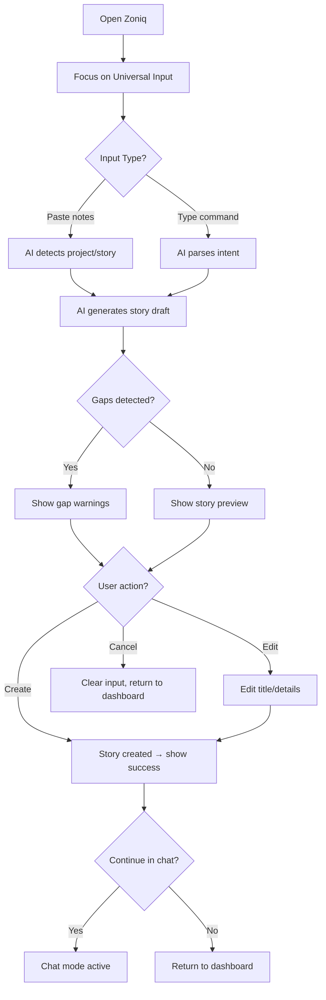
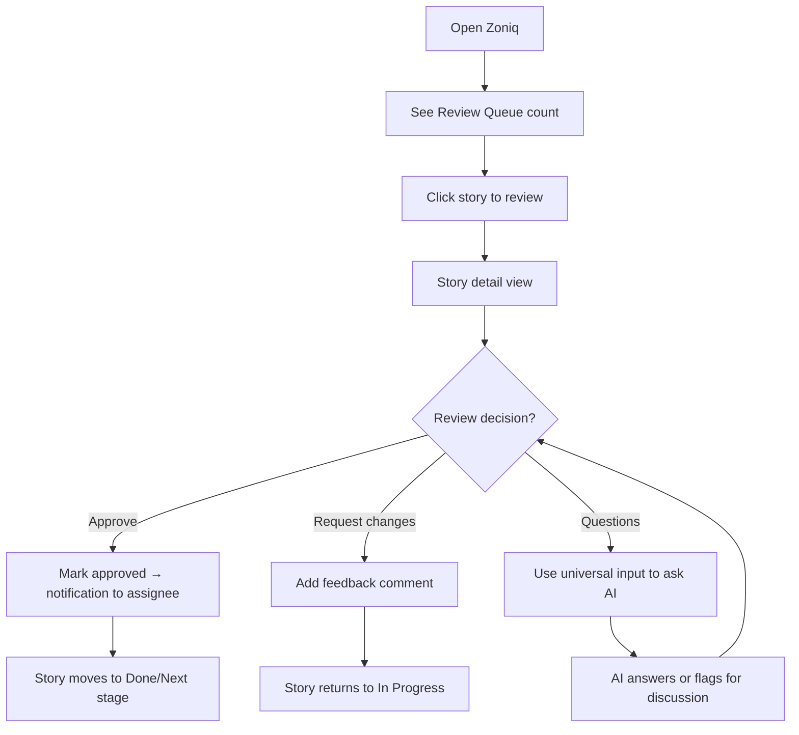
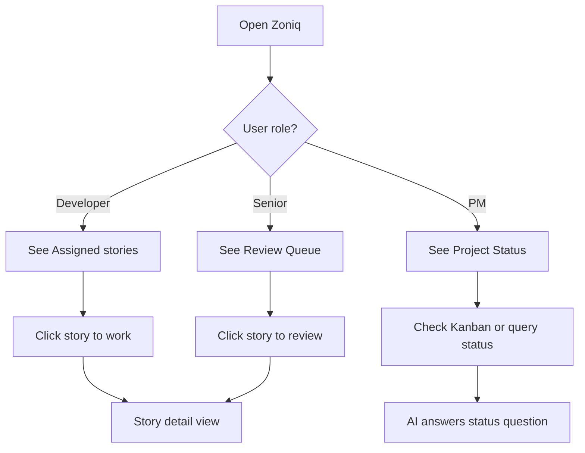
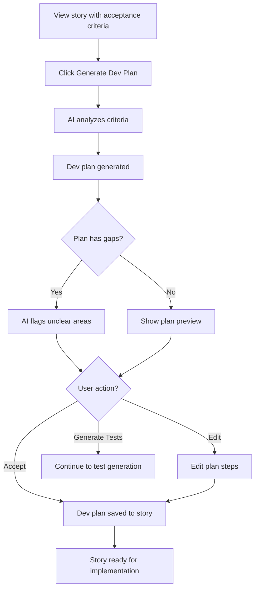

# UX Design Specification BMAD Zoniq

**Author:** David
**Date:** 2026-02-26

---

## Executive Summary

### Project Vision

Zoniq transforms documentation from painful overhead into a speed advantage for Mendix development teams. By instantly converting unstructured notes into acceptance criteria, development plans, and automated test scripts, it rewards documentation effort with immediate value—making speed the carrot that drives quality.

### Target Users

**Aisha (Junior Mendix Developer)**
- 2-3 years experience, competent builder
- Meets clients directly, often alone
- Struggles with vague requirements, rework, and anxiety about "what to build?"
- Needs: AI prep questions, notes-to-story conversion, gap detection

**Marcus (Business Senior / PM)**
- Excellent verbal communicator, great in meetings
- NOT technical, terrible at writing requirements
- Creates handoff friction through poor documentation
- Needs: Voice/note input, AI structuring, looks organized without being a "writer"

**David (Technical Senior / Founder)**
- Only technical senior on team of 6 juniors
- Bottleneck for quality, repeatedly gives same feedback
- Wants team to internalize automation-first thinking
- Needs: Clear review queue, trust in process, less firefighting

### Key Design Challenges

1. **Complexity in Simplicity** — Sophisticated AI workflows must feel effortless, especially for non-technical PMs
2. **Trust & Transparency** — Users need to trust AI output, understand gaps, and feel confident editing
3. **Multi-Persona Experience** — Same tool serves different mental models (guidance-seeking juniors, speed-seeking PMs, clarity-seeking seniors)

### Design Opportunities

1. **Progressive Disclosure** — Surface AI power when needed, keep initial experience simple and inviting
2. **Confidence Indicators** — Visual cues for story completeness, gap status, and AI generation quality
3. **Flow State Design** — Minimize friction in the notes → criteria → dev plan → test scripts loop

## Core User Experience

### Defining Experience

The heart of Zoniq is the **transformation moment** — when chaotic notes become structured, actionable artifacts. Users dump unstructured thoughts (meeting notes, voice transcripts, client docs), and AI instantly returns acceptance criteria, development plans, and test scripts.

**Core Loop:** Notes → Acceptance Criteria → Dev Plan → Test Scripts

This loop must feel magical. One paste, one click, clear output. No complex forms, no configuration, no friction.

### Platform Strategy

| Decision | Rationale |
|----------|-----------|
| **Primary Platform** | Web (desktop browser) |
| **Input Mode** | Mouse/keyboard |
| **Connectivity** | Always online (no offline mode) |
| **Context** | Office environment, post-meeting workflow |
| **Devices** | Laptops/desktops primarily |

Mobile support is not a priority for MVP — users work at desks after client meetings.

### Effortless Interactions

| Interaction | How It Should Feel |
|-------------|-------------------|
| **Notes → Criteria** | Paste messy text, click once, get structured output |
| **Generation Chain** | Criteria → Dev Plan → Test Scripts flows naturally, no re-entry |
| **Gap Detection** | AI surfaces missing info proactively, user doesn't have to ask |
| **Copy Output** | One-click copy to clipboard, ready for external use |
| **Story Status** | Visual indicators show completeness at a glance |

### Critical Success Moments

1. **First Generation** — User pastes notes, sees structured acceptance criteria → "This is exactly what I needed"
2. **Gap Discovery** — AI flags missing information → "I would have missed that edge case"
3. **Review Clarity** — Senior opens story, understands it in 30 seconds → Trust established
4. **Marcus's Moment** — Chaotic voice notes become clear requirements → Looks competent without being a writer

### Experience Principles

1. **Speed is the Reward** — Every interaction must feel faster than the manual alternative
2. **Embrace the Mess** — Accept chaotic input, output structured clarity
3. **Progressive Power** — Simple start, deeper features revealed when needed
4. **Earned Confidence** — Visual indicators show quality and completeness, building trust over time

## Desired Emotional Response

### Primary Emotional Goals

**Core Feeling: Relief through Speed**

Users should feel that Zoniq just saved them time and headache. The tool rewards documentation effort with immediate value, creating a sense that "this is worth my time."

**Persona-Specific Emotional Targets:**

| Persona | From | To |
|---------|------|-----|
| **Aisha** | Anxiety about "what do I build?" | Confidence and preparedness |
| **Marcus** | Inadequacy at documentation | Competence without changing who he is |
| **David** | Dread of review bottlenecks | Relief and trust in the process |

### Emotional Journey Mapping

| Stage | Desired Feeling |
|-------|-----------------|
| **First discovery** | Curiosity — "This might actually help" |
| **First generation** | Delight — "Wow, that was fast and useful" |
| **After task completion** | Confidence — "AI caught the gaps I would have missed" |
| **Review (seniors)** | Satisfaction — "This story is clear and complete" |
| **Returning to use** | Anticipation — "Let me dump my notes and get value" |

### Micro-Emotions

| Emotion | Priority | Design Focus |
|---------|----------|--------------|
| **Confidence** | Critical | Clear progress indicators, completeness scores |
| **Trust** | Critical | Transparent AI process, easy editing |
| **Relief** | High | One-click actions, minimal friction |
| **Competence** | High | Professional-looking output, "ready to share" |
| **Delight** | Medium | Fast generation, unexpected helpfulness |

### Emotions to Avoid

- **Frustration** — From slow AI or unclear UI
- **Confusion** — From too many options or complex forms
- **Distrust** — From generic or wrong AI output
- **Overwhelm** — From too many features at once

### Emotional Design Principles

1. **Reward Immediately** — Every action should produce instant, visible value
2. **Show the Thinking** — Transparency builds trust in AI output
3. **Make Users Look Good** — Output should be professional and shareable
4. **Catch the Falls** — Gap detection and error handling creates confidence

## UX Pattern Analysis & Inspiration

### Inspiring Products Analysis

**Mendix (Primary Tool)**

| What They Do Well | UX Lesson |
|-------------------|-----------|
| **Global search** — One entry point to access all features | Single search/command palette to find anything |
| **Visual models** — Diagrams, domain models instead of code/tables | Visual story flow, not text-heavy lists |
| **Hides complexity** — Powerful platform, simple interface | AI complexity behind simple actions |

**ChatGPT (Daily Use)**

| What They Do Well | UX Lesson |
|-------------------|-----------|
| **Minimal UI** — Just a chat box, nothing else | Notes input this simple — paste and go |
| **Low barrier** — Type anything, get response | No forms, just dump thoughts |
| **Forgiving input** — Messy questions, structured answers | Exactly what Marcus needs |

### Transferable UX Patterns

**Navigation:**
- **Command palette** (`Ctrl+K`) — Jump to any story, project, or action instantly
- **Minimal sidebar** — Keep focus on content, not navigation

**Interaction:**
- **Chat-like input** — Notes area feels like a conversation, not a form
- **Progressive chain** — AI output leads naturally to next action ("Generate Dev Plan")

**Visual:**
- **Card-based stories** — Visual, scannable, like Mendix domain models
- **Status indicators** — Color-coded completeness scores

### Anti-Patterns to Avoid

- **Complex forms** — Defeats "embrace the mess" principle
- **Hidden AI actions** — Generation should be one click, not buried
- **Option overload** — Keep it chat-simple, reveal power progressively

### Design Inspiration Strategy

**What to Adopt:**
- Command palette navigation (Mendix pattern) — supports power users
- Chat-simple input (ChatGPT pattern) — lowers barrier for all personas

**What to Adapt:**
- Visual story cards — simpler than Mendix models, but same clarity
- AI conversation flow — more structured than ChatGPT, but same ease

**What to Avoid:**
- Multi-field forms for notes input
- Deep navigation hierarchies
- Feature-heavy initial UI

## Design System Foundation

### Tech Stack

| Layer | Choice | Rationale |
|-------|--------|----------|
| **Framework** | Next.js | Best-in-class React framework, excellent DX, fast builds |
| **Language** | TypeScript | Type safety, better for teams, catches errors early |
| **Component Library** | shadcn/ui | Copy-paste ownership, minimal aesthetic, fully customizable |
| **Styling** | Tailwind CSS | Rapid styling, easy color customization, great with shadcn |

### Visual Direction

**Aesthetic Goals:**
- Light, airy base (soft whites/grays)
- Not monochrome — accent colors for life
- Clean and functional (ChatGPT-like simplicity)
- Slightly playful but professional (rounded corners, subtle animations)

**Color Strategy:**

| Color Role | Direction |
|------------|-----------|
| **Base** | Soft light grays, clean whites |
| **Primary accent** | Playful but professional (e.g., violet, teal, or warm coral) |
| **Status colors** | Success (green), warning (amber), error (red) — standard but not harsh |

### Implementation Approach

1. Initialize Next.js project with TypeScript
2. Install and configure Tailwind CSS
3. Add shadcn/ui components as needed (start minimal)
4. Define custom color palette in Tailwind config
5. Build component library incrementally

### Customization Strategy

**What to Customize:**
- Color palette (light base + playful accent)
- Border radius (slightly rounded for approachable feel)
- Typography (clean, readable, not sterile)

**What to Keep Default:**
- Component structure and patterns
- Accessibility features
- Animation/transition patterns

## Defining Core Experience

### The Defining Experience

**"Universal AI Agent — one input field for everything"**

The universal input is not just for note capture — it's a conversational command center that handles:
- **Capture** → Notes to structured stories
- **Navigate** → "Open story 47"
- **Query** → "What's the status of Claims Portal?"
- **Search** → "Show stories about export"
- **Action** → "Assign #47 to Aisha"
- **Review** → "What do I need to review?"

**Type or paste anything. The AI figures out intent and responds.**

### Home Screen Architecture

```
┌─────────────────────────────────────────────────────────────────────┐
│  ZONIQ                                    [Create] [Edit] [⚙️] [⌘K] │
├─────────────────────────────────────────────────────────────────────┤
│                                                                     │
│  ┌─────────────────────────────────────────────────────────────┐   │
│  │ 🔮 Ask me anything...                                       │   │
│  │                                                             │   │
│  │ Placeholder: "Paste notes, or try 'What do I review?'"      │   │
│  └─────────────────────────────────────────────────────────────┘   │
│                                                                     │
│  [AI Response Area — inline responses appear here]                  │
│                                                                     │
├───────────────────────────────────┬─────────────────────────────────┤
│  YOUR WORK                        │  PROJECT STATUS                 │
│  ─────────────────────────────    │  ─────────────────────────────  │
│                                   │                                 │
│  📋 Assigned to You               │  Claims Portal        72% ████░ │
│  [Story cards]                    │  Policy Management    45% ██░░░ │
│                                   │                                 │
│  🔍 Review Queue                  │  Team Activity (Today)          │
│  [Stories for review]             │  [Activity feed]                │
│                                   │                                 │
└───────────────────────────────────┴─────────────────────────────────┘
```

### Universal Input Capabilities

| Intent Type | Example Input | AI Response |
|-------------|---------------|-------------|
| **Capture** | [Pastes notes] | "New story for [Project]?" [Create] |
| **Navigate** | "Open story 47" | Direct navigation to story |
| **Query** | "Status of Claims Portal?" | Inline project status card |
| **Search** | "Stories about export" | List of matching stories |
| **Action** | "Assign #47 to Aisha" | Confirmation + [View Story] |
| **Review** | "What do I review?" | Inline review queue |
| **Create** | "New story for Policy" | Story form, project pre-filled |

### Interaction Patterns

**Pattern 1: Inline Response**
```
User: "What's the status of Claims Portal?"

AI:   ┌─────────────────────────────────────┐
      │ Claims Portal — 72% Complete        │
      │ ████████░░                          │
      │                                     │
      │ 24 stories · 16 ready · 5 in review │
      │ ⚠️ 2 stories blocked                │
      │                                     │
      │ [View Project] [Show Blocked]       │
      └─────────────────────────────────────┘
```

**Pattern 2: Action Confirmation**
```
User: "Assign story 47 to Aisha"

AI:   ✅ Done. Story #47 assigned to Aisha.
      [View Story]
```

**Pattern 3: Smart Capture**
```
User: [Pastes notes about approval workflow]

AI:   📝 This looks like a new story for Claims Portal.
      
      Title: "Approval Workflow by Role"
      
      [Create Story] [Different Project] [Edit Title]
```

**Pattern 4: Navigation**
```
User: "Open story 47"

AI:   → [Navigates directly to story #47]
```

**Pattern 5: Search Results**
```
User: "Show stories about export"

AI:   🔍 3 stories matching "export":
      
      #49 Export Feature · In Progress · 60%
      #32 CSV Export · Done · 100%
      #28 PDF Export · Ready · 85%
      
      [Open #49] [Open #32] [Open #28]
```

### Placeholder Rotation

The input placeholder rotates to teach users capabilities:

- "Paste notes, or try 'What do I need to review?'"
- "Try: 'Open story 47' or 'How's Claims Portal?'"
- "Ask me anything about your projects..."
- "Create a story, or ask 'What's blocked?'"

### Role-Aware Dashboard

| User Role | "Your Work" Shows | Universal Input Suggests |
|-----------|-------------------|-------------------------|
| **Developer (Aisha)** | Assigned stories | "Try: 'What should I work on?'" |
| **Senior (David)** | Review queue | "Try: 'What needs review?'" |
| **PM (Marcus)** | Project status | "Try: 'How's Claims Portal?'" |

### Story Card Design

**Unified Card Structure:**
```
┌─────────────────────────────────────────────┐
│ 🔴  #47 Approval Workflow            [A]    │  ← Priority · Title · Assignee
│                                             │
│ Implement multi-level approval based on     │  ← Description
│ user role and amount                        │
│                                             │
│ 📂 Claims Portal · In Progress              │  ← Project · Status
└─────────────────────────────────────────────┘
```

| Element | Position | Purpose |
|---------|----------|---------|
| **Priority dot** | Left of title | Visual urgency indicator (red/amber/gray) |
| **Story number + title** | Header left | Quick identification |
| **Assignee avatar** | Header right (top-right corner) | Who owns/submitted the story |
| **Description** | Body | Context without opening the card |
| **Project name** | Footer left (with folder icon) | Which project this belongs to |
| **Status badge** | Footer right (bottom-right corner) | Current workflow state |

**Priority Levels:**
| Level | Dot Color | Hex | Use |
|-------|-----------|-----|-----|
| High | Red | `#EF4444` | Urgent/critical stories |
| Medium | Amber | `#F59E0B` | Normal priority |
| Low | Gray | `#9A948D` | Low priority |

**Status Values:**
| Status | Badge Color | Meaning |
|--------|-------------|---------|
| Ready | Green | Ready for review/work |
| In Progress | Amber | Currently being worked on |
| In Review | Blue | Awaiting code review |

**Card Background Strategy:**

All cards throughout the dashboard use a consistent warm gray background (`#F5F2EF`) for visual unity and clear separation from white container backgrounds:

| Element | Background | Rationale |
|---------|------------|-----------|
| **Story Cards** (all containers) | `#F5F2EF` | Consistent card identity across dashboard |
| **Project Cards** | `#F5F2EF` | Unified visual language |
| **Activity Items** | `#F5F2EF` | Consistent with other card elements |
| **Kanban Columns** | `white` | Crisp white in kanban context (different view) |

**CSS Implementation:**
```css
.story-card.assigned,
.story-card.review {
    background: #F5F2EF;
    border: none;
}
.story-card.assigned .story-card-header,
.story-card.review .story-card-header {
    border-bottom-color: #E8E4E0;
}
.project-card,
.activity-item {
    background: #F5F2EF;
}
```

**Design Rationale:**
- **Unified card color**: All cards share the same warm gray for visual consistency
- **No contextual colors per container**: Simpler mental model, cards look the same everywhere
- **No borders on cards**: Background color alone provides sufficient separation from white containers
- **No progress bar**: Status already indicates workflow state; progress bars added visual noise
- **No percentage**: Status badge is sufficient; numeric percentages were redundant
- **No due date**: Moved to story detail view to keep cards scannable
- **Status anchored to bottom-right**: Consistent position makes it easy to scan
- **Assignee in top-right**: Immediate visibility of who owns the work
- **Icons (not emojis)**: Professional iconography using inline SVGs from Heroicons

### Quick Actions Bar

| Button | Purpose |
|--------|---------|
| **[Create]** | Create new story (manual mode) |
| **[Edit]** | Find and edit existing story |
| **[⚙️]** | Project settings, user preferences |
| **[⌘K]** | Command palette for power users |

### Experience Mechanics

**1. Initiation (Multi-Intent):**

*Intent A: Capture*
- Focus on universal input
- Paste notes, AI detects context
- Quick capture flow

*Intent B: Action*
- Eyes go to "Your Work" column
- Role-aware content surfaces immediately
- Click story to start working

*Intent C: Overview*
- Scan project status column
- Check team activity
- Understand project health

**2. Intent Detection:**
- AI classifies intent (capture, query, action, navigate)
- Response type determined (inline, navigate, confirm)

**3. Response:**
- Inline: Show results in response area
- Navigate: Jump to target
- Confirm: Show action + confirmation button

**4. Follow-up:**
- User can chain commands: "Now assign it to Aisha"
- Context persists within session

### Success Criteria

| Criterion | Target |
|-----------|--------|
| **Instant clarity** | "What do I do?" answered in <2 seconds |
| **Intent accuracy** | 95%+ correct intent classification |
| **Response speed** | Inline responses <2s, navigation instant |
| **Learnable** | Placeholder suggestions teach capabilities |
| **Fallback** | "I'm not sure — did you mean X or Y?" |
| **Chain-able** | Context persists for follow-up commands |

## Visual Design Foundation

### Color System

**Refined Zoniq Palette**

| Category | Color | Hex | Use |
|----------|-------|-----|-----|
| **Primary Accent** | Warm Orange | `#FF6B35` | CTAs, highlights, active states |
| **Primary Dark** | Dark Brown | `#2D1810` | Text, icons, headers |
| **Base Light** | Off-White | `#FAFAF9` | Background, cards |
| **Neutral Light** | Warm Gray | `#E8E4E0` | Secondary backgrounds, hover states |
| **Neutral Medium** | Medium Gray | `#9A948D` | Secondary text, borders, dividers |
| **Success** | Green | `#10B981` | Success states, completion indicators |
| **Warning** | Amber | `#F59E0B` | Warnings, attention needed |
| **Error** | Red | `#EF4444` | Errors, critical issues |

**Semantic Color Mapping**

| Semantic Role | Color | Application |
|---------------|-------|-------------|
| Primary action | Warm Orange | Generate button, Create story, primary CTAs |
| Secondary action | Dark Brown | Secondary buttons, text links |
| Background | Off-White | Page background, card backgrounds |
| Elevated surface | White | Modals, dropdowns, popovers |
| Border | Warm Gray | Card borders, input borders |
| Text primary | Dark Brown | Headings, body text |
| Text secondary | Medium Gray | Descriptions, metadata |

### Typography System

**Single Font Family:** Manrope — Using one font family for both headings and body creates visual consistency and a cleaner, more cohesive aesthetic.

| Role | Font | Weight | Size | Use |
|------|------|--------|------|-----|
| **H1** | Manrope | ExtraBold (800) | 32px | Page titles |
| **H2** | Manrope | Bold (700) | 24px | Section headers |
| **H3** | Manrope | SemiBold (600) | 18px | Card titles, story titles |
| **H4** | Manrope | SemiBold (600) | 16px | Subsection headers |
| **Body** | Manrope | Regular (400) | 16px | Descriptions, content |
| **Body Small** | Manrope | Regular (400) | 14px | Metadata, secondary text |
| **Caption** | Manrope | Medium (500) | 12px | Labels, tags, hints |
| **Button** | Manrope | SemiBold (600) | 14px | Button text |

**Rationale for Single Font:**
- Creates visual unity across the interface
- Manrope's geometric-yet-friendly character works well at all sizes
- Weight contrast (800 vs 400) provides sufficient hierarchy without font-switching jank
- Simpler implementation and faster load times

**Type Scale:**
- Base: 16px
- Scale ratio: 1.25 (major third)
- Line height: 1.5 for body, 1.2 for headings

### Spacing & Layout Foundation

**Base Unit: 8px**

| Token | Value | Use |
|-------|-------|-----|
| `space-1` | 4px | Tight spacing, icon gaps |
| `space-2` | 8px | Default component padding |
| `space-3` | 16px | Card padding, section gaps |
| `space-4` | 24px | Between sections |
| `space-5` | 32px | Major section dividers |
| `space-6` | 48px | Page margins |

**Grid System:**
- 12-column grid
- 24px gutters
- Max content width: 1280px

**Layout Feel:** Balanced — not dense, not airy. Enough white space for clarity, efficient use of screen real estate.

### Accessibility Considerations

- **Contrast ratios:** All text meets WCAG AA (4.5:1 for body, 3:1 for large text)
- **Focus states:** Visible focus rings on all interactive elements
- **Font sizes:** Minimum 14px for readability
- **Interactive targets:** Minimum 44px touch targets

## Design Direction Decision

### Chosen Direction

**Hero Input + Dual Mode (Dashboard / Chat)**

### Key Elements

| Element | Description |
|---------|-------------|
| **Logo** | Zoniq brand mark — orange square with brown abstract icon |
| **Hero Universal Input** | Below header, expands for long text, auto-detects project |
| **Navigation Header** | Create, Edit, Kanban, Settings, ⌘K (expandable for future nav) |
| **Dashboard View** | Three-column: Assigned, Review Queue, Project Status |
| **Chat Mode** | Full conversation history, AI creates/updates stories inline |
| **Mode Toggle** | Switch between Chat and Dashboard views |

### Home Screen Layout

**Default: Dashboard View**
```
┌─────────────────────────────────────────────────────────────────────┐
│  [LOGO] ZONIQ     [Create] [Edit] [Kanban] [⚙️] [⌘K]               │
├─────────────────────────────────────────────────────────────────────┤
│  ┌───────────────────────────────────────────────────────────────┐  │
│  │ ✨ [Paste notes, or try 'What do I review?'...] [Ask]         │  │
│  │ Try: "Open story 47" • "What's blocked?"      0 chars        │  │
│  └───────────────────────────────────────────────────────────────┘  │
├─────────────────────────────────────────────────────────────────────┤
│  ┌───────────────────┬───────────────────┬───────────────────┐      │
│  │ 📋 Assigned       │ 🔍 Review         │ 📊 Projects       │      │
│  │       (3)         │       (5)         │                   │      │
│  │                   │                   │                   │      │
│  │   [stories]       │   [stories]       │  [mini kanban     │      │
│  │   with %          │   with owner      │   per project]    │      │
│  │                   │                   │                   │      │
│  │                   │                   │                   │      │
│  └───────────────────┴───────────────────┴───────────────────┘      │
│  ┌───────────────────────────────────────────────────────────────┐  │
│  │ 👥 Team Activity — [Aisha moved #47] [Marcus created]         │  │
│  └───────────────────────────────────────────────────────────────┘  │
└─────────────────────────────────────────────────────────────────────┘
```

**Chat Mode (after clicking Ask)**
```
┌─────────────────────────────────────────────────────────────────┐
│  [LOGO] ZONIQ     [Chat] [Dashboard]  [Create] [Kanban] [⌘K]   │
├─────────────────────────────────────────────────────────────────┤
│                                                                 │
│  [D] User: Paste notes...                                       │
│                                                                 │
│  [AI] 📝 Creating story. Gaps detected:                         │
│       ⚠️ Approver unavailable scenario                          │
│       [Create Story] [Edit Title]                               │
│                                                                 │
│  [D] Create it. What do I review?                               │
│                                                                 │
│  [AI] ✅ Story #63 created. You have 5 stories to review:       │
│       #44 Login Flow (Aisha)                                    │
│       #45 Dashboard (Marcus)                                    │
│       ...                                                       │
│                                                                 │
├─────────────────────────────────────────────────────────────────┤
│  [Continue conversation...]                          [Send]     │
└─────────────────────────────────────────────────────────────────┘
```

### Mini Kanban Columns

| Column | Color | Meaning |
|--------|-------|---------|
| Backlog | Gray | Not started |
| In Progress | Amber | Active work |
| Testing | Purple | QA/testing |
| Review | Blue | Awaiting review |
| Done | Green | Complete |

### Story Card Elements

- Status badge (Urgent/Ready/In Progress/Review)
- Story number + title
- Percentage complete
- Progress bar
- Assignee (in review queue)

### Design Rationale

1. **Hero input encourages AI-first** — Prominent placement, expands for long notes
2. **Chat mode supports conversational workflow** — Create → refine → query in one flow
3. **Dashboard provides at-a-glance status** — All personas see relevant info immediately
4. **Mini Kanban shows project health** — Visual distribution without clicking away
5. **Mode toggle gives user control** — Switch contexts when needed

### Visual Reference

Full interactive mockup: `_bmad-output/planning-artifacts/ux-design-final.html`

## User Journey Flows

### Journey 1: Quick Capture

**Persona:** Marcus (PM), Aisha (Developer)
**Goal:** Transform unstructured notes into a structured story in seconds



**Entry Points:**
- Dashboard universal input (default)
- Chat mode continuation
- ⌘K command palette

**Success Metrics:**
- Time from paste to story created: <10 seconds
- Gaps caught before creation: 80%+

---

### Journey 2: Review & Approve

**Persona:** David (Senior)
**Goal:** Quickly review stories and provide feedback or approval



**Entry Points:**
- Review Queue card on dashboard
- "What do I review?" command in universal input
- Direct link from notification

**Success Metrics:**
- Time to understand story: <30 seconds
- Review completed: <2 minutes

---

### Journey 3: Start My Day

**Persona:** All
**Goal:** Immediately see what needs attention based on role



**Role-Aware Dashboard:**

| Role | Primary Card | Secondary |
|------|--------------|-----------|
| Developer | Assigned to You | Review Queue (if any) |
| Senior | Review Queue | Project Status |
| PM | Project Status | Team Activity |

---

### Journey 4: Generate Dev Plan

**Persona:** Aisha (Developer)
**Goal:** Transform acceptance criteria into actionable development plan



**Chain Flow:**
1. Notes → Acceptance Criteria
2. Acceptance Criteria → Dev Plan
3. Dev Plan → Test Scripts

---

### Journey Patterns

| Pattern | Description | Used In |
|---------|-------------|---------|
| **One-click entry** | Single action to start any journey | All journeys |
| **AI-first generation** | AI produces draft, user refines | Capture, Dev Plan |
| **Inline gap detection** | Warnings shown in flow, not separate modal | Capture, Dev Plan |
| **Role-aware defaults** | Dashboard shows relevant content | Start My Day |
| **Chain actions** | Complete task, offered logical next step | Capture → Dev Plan → Tests |
| **Chat persistence** | Conversation continues across actions | All via universal input |

### Flow Optimization Principles

1. **Minimize clicks to value** — Every journey starts with one action
2. **AI generates, user refines** — Never start from blank
3. **Inline feedback** — Gaps and warnings in context, not blocking modals
4. **Role-aware defaults** — See what matters most immediately
5. **Graceful recovery** — Cancel always returns to safe state
6. **Progress visibility** — Always know where you are in a flow

## Component Strategy

### Design System Components (shadcn/ui)

**Available Foundation Components:**

| Component | Use Case |
|-----------|----------|
| Button | CTAs, form submissions, actions |
| Input / Textarea | Text entry, notes input |
| Select | Dropdowns, filters |
| Dialog / Sheet | Modals, side panels |
| Tabs | Content organization (story tabs) |
| Avatar | User representation, assignees |
| Badge | Status indicators, tags |
| Card | Container for content blocks |
| Dropdown Menu | Context menus, actions |
| Popover / Tooltip | contextual info, hints |
| Command | ⌘K command palette |
| Progress | Completion indicators |
| Skeleton | Loading states |
| Separator | Visual dividers |
| Scroll Area | Scrollable containers |

### Custom Components

#### 1. UniversalInput

**Purpose:** Single input field for capture, navigate, query, and action — the hero interaction element.

| Attribute | Specification |
|-----------|---------------|
| **Content** | Free-form text, pasted notes, commands |
| **States** | Default, focused, expanded (multi-line), loading (AI processing) |
| **Variants** | Compact (header), Expanded (chat mode) |
| **Features** | Auto-expand textarea, placeholder rotation, character count, submit button |
| **Accessibility** | `aria-label="Ask me anything"`, Enter to submit, Shift+Enter for newline |

#### 2. StoryCard

**Purpose:** Display story summary for quick scanning in lists and dashboards.

| Attribute | Specification |
|-----------|---------------|
| **Content** | Story #, title, status badge, % complete, due date, assignee avatar |
| **States** | Default, hover (subtle lift), selected |
| **Variants** | Compact (dashboard list), Full (story list page) |
| **Accessibility** | Clickable, keyboard navigable, `aria-label` with full context |

#### 3. CompletenessMeter

**Purpose:** Visual story completeness indicator with color-coded progress.

| Attribute | Specification |
|-----------|---------------|
| **Content** | Percentage, progress bar |
| **States** | Color-coded: red (<50%), amber (50-80%), green (>80%) |
| **Accessibility** | `aria-valuenow`, `aria-valuemin`, `aria-valuemax` |

#### 4. GapIndicator

**Purpose:** Flag missing information in stories before "Ready" status.

| Attribute | Specification |
|-----------|---------------|
| **Content** | Warning icon, gap description |
| **States** | Default, dismissible |
| **Accessibility** | `role="alert"`, high contrast |

#### 5. AIResponseCard

**Purpose:** Display inline AI responses in dashboard/chat.

| Attribute | Specification |
|-----------|---------------|
| **Content** | Varies: status cards, confirmations, search results, story previews |
| **States** | Default, with action buttons |
| **Variants** | Status, Confirmation, SearchResults, StoryPreview |

#### 6. MiniKanban

**Purpose:** Show project status distribution at a glance on dashboard.

| Attribute | Specification |
|-----------|---------------|
| **Content** | Column headers with count, mini story indicators |
| **States** | Static display (clicking opens full Kanban) |
| **Accessibility** | `aria-label` with column counts |

#### 7. KanbanBoard

**Purpose:** Full project workflow visualization with drag-drop story management.

| Attribute | Specification |
|-----------|---------------|
| **Content** | Columns (Backlog, In Progress, Testing, Review, Done), story cards |
| **States** | Default, dragging (card lifted), drop-target (column highlighted) |
| **Features** | Drag-and-drop, column collapse, filters, quick actions on hover |
| **Accessibility** | Keyboard drag (Space to pick up, arrows to move, Space to drop) |

#### 8. KanbanColumn

**Purpose:** Container for stories in a status within KanbanBoard.

| Attribute | Specification |
|-----------|---------------|
| **Content** | Column header, count, story cards, "Add story" button |
| **States** | Default, drop-target, collapsed |

#### 9. StoryHeader

**Purpose:** Display story identity and key metadata in detail view.

| Attribute | Specification |
|-----------|---------------|
| **Content** | Story #, title, status badge, priority, assignee avatar, due date |
| **Actions** | Edit, Delete, Change status |

#### 10. StoryTabs

**Purpose:** Content organization for story detail page.

| Tab | Content |
|-----|---------|
| **Overview** | Description, notes, attachments |
| **Acceptance Criteria** | AI-generated + manual criteria list |
| **Dev Plan** | AI-generated implementation steps |
| **Test Scripts** | AI-generated Playwright scripts |
| **Activity** | Comments, history log |

#### 11. AcceptanceCriteriaList

**Purpose:** Display and manage acceptance criteria for a story.

| Attribute | Specification |
|-----------|---------------|
| **Content** | Criteria items with checkboxes, AI-generated badge |
| **Actions** | Add, edit, delete, regenerate (AI) |
| **States** | Checked/unchecked, editing |

#### 12. DevPlanViewer

**Purpose:** Display AI-generated development plan with step management.

| Attribute | Specification |
|-----------|---------------|
| **Content** | Ordered steps with descriptions, Mendix domain hints |
| **Actions** | Regenerate, edit, mark step complete |
| **States** | Collapsed/expanded per step |

#### 13. TestScriptViewer

**Purpose:** Display AI-generated Playwright test scripts.

| Attribute | Specification |
|-----------|---------------|
| **Content** | Playwright code block, syntax highlighted |
| **Actions** | Copy to clipboard, regenerate, download |
| **Features** | Line numbers, scrollable |

#### 14. GapWarningPanel

**Purpose:** Show detected gaps before "Ready" status can be set.

| Attribute | Specification |
|-----------|---------------|
| **Content** | List of gaps with descriptions, severity |
| **Actions** | Dismiss, "Mark as addressed" |
| **States** | Collapsed sidebar / expanded panel |

#### 15. CommentThread

**Purpose:** Review feedback and discussion on stories.

| Attribute | Specification |
|-----------|---------------|
| **Content** | Comments with author, timestamp, replies |
| **Actions** | Add comment, reply, @mention |
| **States** | Default, composing |

#### 16. ActivityLog

**Purpose:** Story history (status changes, edits, AI generations).

| Attribute | Specification |
|-----------|---------------|
| **Content** | Timeline of changes with actor, timestamp |

#### 17. ActivityFeed

**Purpose:** Show recent team activity on dashboard.

| Attribute | Specification |
|-----------|---------------|
| **Content** | User avatar, action description, timestamp |
| **States** | Default, hover (highlight) |
| **Accessibility** | List semantics, relative time |

#### 18. AttachmentUploader

**Purpose:** Client docs, screenshots, reference materials.

| Attribute | Specification |
|-----------|---------------|
| **Actions** | Upload, preview, delete, download |

### Component Implementation Strategy

**Foundation (shadcn/ui):**
Button, Input, Textarea, Card, Badge, Dialog, Command, Progress, Avatar, Dropdown Menu, Tabs, Tooltip, Scroll Area, Skeleton, Separator

**Custom Built (using Tailwind + shadcn patterns):**
- UniversalInput — core interaction component
- StoryCard — primary content display
- CompletenessMeter — progress visualization
- GapIndicator, GapWarningPanel — quality feedback
- KanbanBoard, KanbanColumn, MiniKanban — workflow visualization
- StoryHeader, StoryTabs — detail page structure
- AcceptanceCriteriaList, DevPlanViewer, TestScriptViewer — AI output display
- CommentThread, ActivityLog, ActivityFeed — collaboration
- AIResponseCard — inline AI feedback
- AttachmentUploader — file management

**Implementation Principles:**
- Build custom components using Tailwind + shadcn primitives
- Use design tokens from Visual Design Foundation (colors, typography, spacing)
- Compose from shadcn components where possible
- Full accessibility compliance (WCAG AA)
- Consistent interaction patterns across all custom components

### Implementation Roadmap

**Phase 1 — Core (MVP):**
| Component | Needed For |
|-----------|------------|
| UniversalInput | All capture flows |
| StoryCard | Dashboard & story lists |
| CompletenessMeter | Story status display |
| StoryHeader | Story detail page |
| StoryTabs | Story detail page |
| AcceptanceCriteriaList | Story detail page |
| GapWarningPanel | Story quality gate |

**Phase 2 — Kanban & Detail:**
| Component | Needed For |
|-----------|------------|
| KanbanBoard | Full workflow view |
| KanbanColumn | KanbanBoard |
| DevPlanViewer | Story detail page |
| TestScriptViewer | Story detail page |
| CommentThread | Review workflow |
| ActivityLog | Story history |

**Phase 3 — Enhancement:**
| Component | Needed For |
|-----------|------------|
| MiniKanban | Dashboard project status |
| AIResponseCard | Universal input responses |
| ActivityFeed | Dashboard collaboration |
| AttachmentUploader | Story attachments |

## UX Consistency Patterns

### Button Hierarchy

| Level | Use Case | Visual Style |
|-------|----------|--------------|
| **Primary** | Main actions (Generate, Create, Save) | Warm Orange fill (`#FF6B35`), white text |
| **Secondary** | Alternative actions (Cancel, Edit) | Dark Brown outline (`#2D1810`), brown text |
| **Tertiary** | Low-priority links (View, Learn more) | Text only, orange on hover |
| **Destructive** | Dangerous actions (Delete) | Red fill (`#EF4444`), white text |
| **Ghost** | Inline actions within content | Transparent, brown text, hover gray bg |

**Button Rules:**
- One primary action per context
- Primary always on right or bottom
- Destructive actions require confirmation dialog
- Loading state: spinner icon + disabled
- Minimum width: 80px
- Border radius: 8px (consistent with design system)

### Feedback Patterns

**Toast Notifications:**

| Type | Color | Icon | Duration | Example |
|------|-------|------|----------|---------|
| **Success** | Green `#10B981` | ✓ checkmark | 3s auto-dismiss | "Story created" |
| **Error** | Red `#EF4444` | ✗ X mark | 5s + manual dismiss | "AI generation failed" |
| **Warning** | Amber `#F59E0B` | ⚠ triangle | 4s + manual dismiss | "Gaps detected in story" |
| **Info** | Blue | ℹ circle | 3s auto-dismiss | "Story assigned to you" |

**Toast Position:** Bottom-right corner, stacked vertically

**Toast Actions:** Optional action button (e.g., "View Story", "Undo")

**Inline Field Feedback:**
- Success: Green border + check icon on field
- Error: Red border + error message below field
- Warning: Amber border + warning message below field

### Form Patterns

**Layout:**
- Single column layout (no multi-column forms)
- Labels above inputs, not inline
- Required fields marked with asterisk (*)
- Helper text below input in Medium Gray (`#9A948D`)
- Consistent 16px vertical spacing between fields

**Validation:**
- Real-time validation on blur (not on type)
- Error messages: Clear, specific, actionable
  - ❌ "Invalid input"
  - ✓ "Story title must be at least 5 characters"
- Validation icon appears inside input on right

**AI Generation Forms:**
- Notes input: Large textarea, auto-expand to 200px max
- Generate button: Primary styling, prominent placement
- Loading: Skeleton in output area + "Generating..." text
- Retry option always available on failure

### Navigation Patterns

**Primary Navigation (Header):**
| Position | Element |
|----------|---------|
| Left | Logo + brand name "ZONIQ" |
| Center-left | Nav items: Dashboard, Kanban, Projects |
| Center | Universal input (hero) |
| Right | ⌘K trigger, User avatar/menu |

**Command Palette (⌘K):**
- Opens with `Cmd/Ctrl + K`
- Search bar focused automatically on open
- Sections: Quick Actions, Recent Stories, Projects
- Arrow keys to navigate, Enter to select, Escape to close
- Fuzzy search across all content

**Breadcrumbs:**
- Format: Projects > [Project Name] > [Story #]
- All segments clickable except current
- Hidden on mobile (use back button pattern)

### Modal & Overlay Patterns

**Dialog (Modal):**
- Centered on screen, max-width 480px
- Backdrop: Semi-transparent dark (`rgba(0,0,0,0.5)`)
- Structure: Header + content + footer (actions)
- Close methods: X button (top-right), Escape key, click outside backdrop
- Focus trap active when open
- Body scroll locked

**Sheet (Side Panel):**
- Slides in from right edge
- Width variants: 400px (narrow) / 600px (wide)
- Use cases: Story detail preview, settings panels, filters
- Close: X button, Escape key, swipe gesture (future mobile)

**Confirmation Dialog:**
- Title format: Action verb + object ("Delete Story?")
- Body: Clear consequence explanation
- Actions: Cancel (secondary, left) + Confirm (destructive/primary, right)
- Destructive confirm: Red button

### Empty States

| Context | Message | Action |
|---------|---------|--------|
| No stories | "No stories yet" | "Paste notes to create your first story" + focus universal input |
| No search results | "No stories match '[query]'" | "Try different keywords or check spelling" |
| No review queue | "All caught up!" | "No stories need your review right now" |
| No activity | "No recent activity" | None (just illustration) |
| No projects | "No projects yet" | "Create Project" button |

**Empty State Visuals:** Illustration or icon + primary message + optional secondary text + optional action button

### Loading States

| Context | Pattern |
|---------|---------|
| AI generation | Skeleton in output area + "Generating..." text + spinner in button |
| Page load | Skeleton cards matching final layout |
| Button action | Spinner icon in button + disabled state |
| List load | Shimmer effect on list items |
| Inline update | Subtle pulse on updated element |

**Skeleton Styling:** Warm Gray (`#E8E4E0`) background, Off-White (`#FAFAF9`) shimmer animation

### Search & Filtering Patterns

**Universal Input Search:**
- User types "Search [query]" or just query terms
- AI detects search intent
- Results appear inline as AIResponseCard with clickable story cards

**Filter Bar (Kanban/List views):**
- Dropdown filters: Status, Assignee, Project
- Active filters shown as removable badges
- "Clear all" button when filters active
- Filter count badge on filter icon

### AI Interaction Patterns

**Generation Flow:**
1. User triggers generation (button click or command)
2. Loading state: Skeleton in output area, spinner in button
3. Result appears: Editable content with action buttons
4. Actions available: Accept, Edit, Regenerate, Copy

**Gap Detection:**
- Inline warning panel below generated content
- Amber background (`#FEF3C7`), warning icon
- Format: "Missing: [gap description]"
- Each gap has "Dismiss" and "Mark addressed" actions

**Retry Pattern:**
- On AI failure: Error toast + inline error message + "Retry" button
- On timeout (>15s): "Taking longer than usual..." + "Cancel" option
- Max 3 retries before suggesting manual entry

**Confidence Indicators:**
- High confidence: No indicator (clean output)
- Medium confidence: Subtle amber badge "Review suggested"
- Low confidence: Warning banner "May need manual review"

## Story Detail Page

### Page Overview

The Story Detail page is the primary workspace for working with individual stories. It serves all personas but with different priorities:

| Persona | Primary Use | Focus |
|---------|-------------|-------|
| **Aisha (Developer)** | Building stories | Dev plan, test scripts, acceptance criteria |
| **Marcus (PM)** | Creating stories | Overview, notes, acceptance criteria generation |
| **David (Senior)** | Reviewing stories | Quick scan, approval/rejection, comments |

### Full Page Layout

```
┌─────────────────────────────────────────────────────────────────────────────┐
│  [← Back]   Claims Portal > #47 Approval Workflow              [⌘K] [👤]   │
├─────────────────────────────────────────────────────────────────────────────┤
│                                                                             │
│  ┌─────────────────────────────────────────────────────────────────────┐   │
│  │ #47  Approval Workflow by Role                              🔴 HIGH │   │
│  │                                                                     │   │
│  │ Implement multi-level approval based on user role and amount       │   │
│  │                                                                     │   │
│  │ ┌─────────────────────────────────────────────────────────────────┐│   │
│  │ │ Status: In Progress   │  Assignee: [Aisha avatar] Aisha        ││   │
│  │ │ Project: Claims Portal│  Due: Mar 15, 2026                     ││   │
│  │ │ Complete: 65% ██████░░│  Created: Feb 28, 2026 by Marcus      ││   │
│  │ └─────────────────────────────────────────────────────────────────┘│   │
│  │                                                                     │   │
│  │ [Edit] [Change Status ▾] [Delete]                    [Save Changes]│   │
│  └─────────────────────────────────────────────────────────────────────┘   │
│                                                                             │
│  ┌─────────────────────────────────────────────────────────────────────┐   │
│  │ Overview │ Acceptance Criteria │ Dev Plan │ Test Scripts │ Activity │   │
│  └─────────────────────────────────────────────────────────────────────┘   │
│                                                                             │
│  ┌───────────────────────────────────────────────────────┬───────────────┐ │
│  │                                                       │               │ │
│  │  [TAB CONTENT AREA - see below for each tab]          │  ⚠️ GAPS (2)  │ │
│  │                                                       │  ──────────── │ │
│  │                                                       │               │ │
│  │                                                       │  ⚠️ Missing:  │ │
│  │                                                       │  Approver     │ │
│  │                                                       │  unavailable  │ │
│  │                                                       │  scenario     │ │
│  │                                                       │               │ │
│  │                                                       │  ⚠️ Missing:  │ │
│  │                                                       │  Delegation   │ │
│  │                                                       │  rules        │ │
│  │                                                       │               │ │
│  │                                                       │  [Dismiss All]│ │
│  │                                                       │               │ │
│  └───────────────────────────────────────────────────────┴───────────────┘ │
│                                                                             │
└─────────────────────────────────────────────────────────────────────────────┘
```

### Page Header (StoryHeader Component)

| Element | Description | Actions |
|---------|-------------|---------|
| **Back button** | Returns to previous context (Dashboard, Kanban, or Project) | Click to navigate back |
| **Breadcrumbs** | Project > Story # | Clickable project name |
| **Story # + Title** | "#47 Approval Workflow by Role" | Inline editable on click |
| **Priority badge** | 🔴 HIGH / 🟡 MEDIUM / ⚪ LOW | Dropdown to change |
| **Description** | Brief summary of story purpose | Inline editable |
| **Status** | In Progress / Ready / Review / Done | Dropdown to change |
| **Assignee** | Avatar + name | Dropdown to reassign |
| **Project** | Linked project name | Click to view project |
| **Due date** | Calendar date | Date picker |
| **Completeness** | Percentage + progress bar | Auto-calculated |
| **Created info** | Date + author | Non-editable |
| **Action buttons** | Edit, Change Status, Delete, Save | Context-aware |

### Tab Navigation (StoryTabs Component)

**Tab Bar Layout:**
```
┌─────────┬─────────────────────┬──────────┬──────────────┬──────────┐
│Overview │ Acceptance Criteria │ Dev Plan │ Test Scripts │ Activity │
│   (1)   │         (4)         │   (5)    │      (0)     │    •     │
└─────────┴─────────────────────┴──────────┴──────────────┴──────────┘
          ↑ Badge shows count of items
```

---

### Tab 1: Overview

**Purpose:** Story context, original notes, and attachments

```
┌─────────────────────────────────────────────────────────────────────┐
│                                                                     │
│  DESCRIPTION                                                        │
│  ─────────────────────────────────────────────────────────────────  │
│  Implement multi-level approval workflow based on user role and    │
│  request amount. Managers approve up to $5K, Directors up to $25K, │
│  VP approval required for amounts above $25K.                       │
│                                                                     │
│  ─────────────────────────────────────────────────────────────────  │
│                                                                     │
│  ORIGINAL NOTES                                                     │
│  ─────────────────────────────────────────────────────────────────  │
│  ┌─────────────────────────────────────────────────────────────┐   │
│  │ Client wants approval workflow. Different levels based on $ │   │
│  │ amounts. Managers can do small stuff, directors medium, VPs │   │
│  │ for big amounts. Need to handle when someone is on leave.   │   │
│  │ Also what happens if approver quits or is unavailable?      │   │
│  │                                           - Marcus, Feb 28  │   │
│  └─────────────────────────────────────────────────────────────┘   │
│                                                                     │
│  ─────────────────────────────────────────────────────────────────  │
│                                                                     │
│  ATTACHMENTS (2)                                                    │
│  ─────────────────────────────────────────────────────────────────  │
│  ┌─────────────────────────────────────────────────────┐           │
│  │ 📄 approval-flow-diagram.png               [View][x]│           │
│  │ 📄 client-email-approval-requirements.pdf  [View][x]│           │
│  └─────────────────────────────────────────────────────┘           │
│  [+ Add Attachment]                                                 │
│                                                                     │
└─────────────────────────────────────────────────────────────────────┘
```

**Overview Content:**

| Section | Content | Actions |
|---------|---------|---------|
| **Description** | Full story description | Edit inline, auto-save |
| **Original Notes** | Raw notes/voice transcript from creation | View only, expandable |
| **Attachments** | Uploaded files (images, PDFs, docs) | Upload, view, download, delete |

---

### Tab 2: Acceptance Criteria

**Purpose:** AI-generated and manual acceptance criteria management

```
┌─────────────────────────────────────────────────────────────────────┐
│                                                                     │
│  ┌─────────────────────────────────────────────────────────────┐   │
│  │ ✨ [Paste notes to regenerate criteria, or add manually...] │   │
│  │                                                 [Generate]  │   │
│  └─────────────────────────────────────────────────────────────┘   │
│                                                                     │
│  ACCEPTANCE CRITERIA (4)                          Last generated:  │
│  ────────────────────────────────────────────────  Feb 28, 2:34 PM │
│                                                                     │
│  ┌─────────────────────────────────────────────────────────────┐   │
│  │ ☐ AC1: Manager approval for amounts ≤ $5,000         ✨ AI   │   │
│  │   Given a request with amount ≤ $5,000                       │   │
│  │   When a Manager submits approval                            │   │
│  │   Then the request is approved                               │   │
│  │                                          [Edit] [Delete]     │   │
│  └─────────────────────────────────────────────────────────────┘   │
│                                                                     │
│  ┌─────────────────────────────────────────────────────────────┐   │
│  │ ☐ AC2: Director approval for amounts $5,001-$25,000  ✨ AI   │   │
│  │   Given a request with amount between $5,001-$25,000         │   │
│  │   When a Director submits approval                           │   │
│  │   Then the request is approved                               │   │
│  │                                          [Edit] [Delete]     │   │
│  └─────────────────────────────────────────────────────────────┘   │
│                                                                     │
│  ┌─────────────────────────────────────────────────────────────┐   │
│  │ ☐ AC3: VP approval for amounts > $25,000             ✨ AI   │   │
│  │   Given a request with amount > $25,000                      │   │
│  │   When a VP submits approval                                 │   │
│  │   Then the request is approved                               │   │
│  │                                          [Edit] [Delete]     │   │
│  └─────────────────────────────────────────────────────────────┘   │
│                                                                     │
│  ┌─────────────────────────────────────────────────────────────┐   │
│  │ ☐ AC4: Delegation when approver is unavailable        ✨ AI   │   │
│  │   Given an approver is marked as unavailable                 │   │
│  │   When a request requires their approval                     │   │
│  │   Then the request is routed to their delegate               │   │
│  │                                          [Edit] [Delete]     │   │
│  └─────────────────────────────────────────────────────────────┘   │
│                                                                     │
│  [+ Add Criterion]                                                  │
│                                                                     │
│  ─────────────────────────────────────────────────────────────────  │
│  ✅ Ready to generate Dev Plan?                                     │
│  [Generate Dev Plan →]                                              │
│                                                                     │
└─────────────────────────────────────────────────────────────────────┘
```

**Acceptance Criteria States:**

| State | Visual | Behavior |
|-------|--------|----------|
| **Unchecked** | ☐ Empty checkbox | Click to mark complete |
| **Checked** | ☑ Filled checkbox, strikethrough | Click to unmark |
| **AI-generated** | ✨ badge + purple tint | Can be edited/regenerated |
| **Manual** | No badge | Added by user |
| **Editing** | Textarea appears | Save/Cancel buttons |

**Actions:**

| Action | Location | Behavior |
|--------|----------|----------|
| **Generate** | Top input bar | AI generates from notes/description |
| **Regenerate** | Dropdown from Generate | Discard current, generate fresh |
| **Add Criterion** | Bottom of list | Open inline form |
| **Edit** | Per criterion | Inline edit mode |
| **Delete** | Per criterion | Confirmation dialog |

---

### Tab 3: Dev Plan

**Purpose:** AI-generated implementation steps with Mendix-specific guidance

```
┌─────────────────────────────────────────────────────────────────────┐
│                                                                     │
│  ┌─────────────────────────────────────────────────────────────┐   │
│  │ Dev Plan not generated yet.                                 │   │
│  │ Acceptance criteria ready? [Generate Dev Plan]              │   │
│  └─────────────────────────────────────────────────────────────┘   │
│                                                                     │
│  OR (after generation):                                             │
│                                                                     │
│  ┌─────────────────────────────────────────────────────────────┐   │
│  │ 🔄 [Regenerate Dev Plan]                    Last: Feb 28    │   │
│  └─────────────────────────────────────────────────────────────┘   │
│                                                                     │
│  IMPLEMENTATION STEPS                                               │
│  ─────────────────────────────────────────────────────────────────  │
│                                                                     │
│  ┌─────────────────────────────────────────────────────────────┐   │
│  │ ▼ Step 1: Create ApprovalLevel Enumeration           ☐ Done│   │
│  │   ──────────────────────────────────────────────────────── │   │
│  │   Create an enumeration in Mendix with values:             │   │
│  │   - Manager ($0-$5,000)                                    │   │
│  │   - Director ($5,001-$25,000)                              │   │
│  │   - VP (>$25,000)                                          │   │
│  │                                                             │   │
│  │   💡 Mendix hint: Domain Model > Add > Enumeration         │   │
│  │                                          [Edit] [Delete]    │   │
│  └─────────────────────────────────────────────────────────────┘   │
│                                                                     │
│  ┌─────────────────────────────────────────────────────────────┐   │
│  │ ▶ Step 2: Extend User Entity with Role/Delegation   ☐ Done  │   │
│  │   [Collapsed - click to expand]                             │   │
│  └─────────────────────────────────────────────────────────────┘   │
│                                                                     │
│  ┌─────────────────────────────────────────────────────────────┐   │
│  │ ▶ Step 3: Create ApprovalRequest Entity            ☐ Done   │   │
│  │   [Collapsed - click to expand]                             │   │
│  └─────────────────────────────────────────────────────────────┘   │
│                                                                     │
│  ┌─────────────────────────────────────────────────────────────┐   │
│  │ ▶ Step 4: Implement Approval Microflow              ☐ Done   │   │
│  │   [Collapsed - click to expand]                             │   │
│  └─────────────────────────────────────────────────────────────┘   │
│                                                                     │
│  ┌─────────────────────────────────────────────────────────────┐   │
│  │ ▶ Step 5: Add Delegation Logic                     ☐ Done   │   │
│  │   [Collapsed - click to expand]                             │   │
│  └─────────────────────────────────────────────────────────────┘   │
│                                                                     │
│  ┌─────────────────────────────────────────────────────────────┐   │
│  │ ▶ Step 6: Create Approval UI Pages                  ☐ Done   │   │
│  │   [Collapsed - click to expand]                             │   │
│  └─────────────────────────────────────────────────────────────┘   │
│                                                                     │
│  [+ Add Step]                                                       │
│                                                                     │
│  ─────────────────────────────────────────────────────────────────  │
│  ✅ Dev Plan complete? Generate test scripts for validation.        │
│  [Generate Test Scripts →]                                          │
│                                                                     │
└─────────────────────────────────────────────────────────────────────┘
```

**Dev Plan Step Structure:**

| Element | Description |
|---------|-------------|
| **Step # + Title** | Collapsible header with step number |
| **Description** | Detailed implementation instructions |
| **Mendix Hint** | Contextual Mendix-specific guidance (💡 icon) |
| **Done checkbox** | Mark step as completed |
| **Actions** | Edit, Delete, reorder (drag handle) |

**Dev Plan States:**

| State | Visual | Behavior |
|-------|--------|----------|
| **Not Generated** | Empty state + Generate button | Prompt to generate |
| **Generating** | Skeleton loader | Show progress |
| **Generated** | Collapsed steps | Expand to view details |
| **Step Expanded** | Full content visible | Collapse to hide |
| **Step Done** | Checkbox filled, green tint | Tracked in completeness |

---

### Tab 4: Test Scripts

**Purpose:** AI-generated Playwright test scripts for automation

```
┌─────────────────────────────────────────────────────────────────────┐
│                                                                     │
│  ┌─────────────────────────────────────────────────────────────┐   │
│  │ Test scripts not generated yet.                             │   │
│  │ Dev plan complete? [Generate Test Scripts]                  │   │
│  └─────────────────────────────────────────────────────────────┘   │
│                                                                     │
│  OR (after generation):                                             │
│                                                                     │
│  ┌─────────────────────────────────────────────────────────────┐   │
│  │ 🔄 [Regenerate Tests]                          Last: Feb 28 │   │
│  └─────────────────────────────────────────────────────────────┘   │
│                                                                     │
│  TEST FILE: approval-workflow.spec.ts                               │
│  ─────────────────────────────────────────────────────────────────  │
│                                                                     │
│  ┌─────────────────────────────────────────────────────────────┐   │
│  │  1 │ import { test, expect } from '@playwright/test';       │   │
│  │  2 │                                                          │   │
│  │  3 │ test.describe('Approval Workflow', () => {              │   │
│  │  4 │   test('Manager approval for amounts ≤ $5,000', async  │   │
│  │  5 │     ({ page }) => {                                      │   │
│  │  6 │     // Login as manager                                  │   │
│  │  7 │     await page.goto('/login');                          │   │
│  │  8 │     await page.fill('[data-testid="email"]',            │   │
│  │  9 │       'manager@test.com');                              │   │
│  │ 10 │     await page.fill('[data-testid="password"]',         │   │
│  │ 11 │       'password');                                       │   │
│  │ 12 │     await page.click('[data-testid="login-btn"]');      │   │
│  │ 13 │                                                          │   │
│  │ 14 │     // Create approval request                          │   │
│  │ 15 │     await page.goto('/requests/new');                   │   │
│  │ 16 │     await page.fill('[data-testid="amount"]', '3000');  │   │
│  │ 17 │     await page.click('[data-testid="submit"]');         │   │
│  │ 18 │                                                          │   │
│  │ 19 │     // Verify approval                                  │   │
│  │ 20 │     await expect(page.locator('.status'))               │   │
│  │ 21 │       .toHaveText('Approved');                          │   │
│  │ 22 │   });                                                    │   │
│  │ ..│ ...                                                       │   │
│  └─────────────────────────────────────────────────────────────┘   │
│                                                                     │
│  ┌─────────────────────────────────────────────────────────────┐   │
│  │ [📋 Copy to Clipboard]  [⬇️ Download .spec.ts]  [Edit]      │   │
│  └─────────────────────────────────────────────────────────────┘   │
│                                                                     │
└─────────────────────────────────────────────────────────────────────┘
```

**Test Script Features:**

| Feature | Description |
|---------|-------------|
| **Syntax highlighting** | TypeScript/JavaScript highlighting |
| **Line numbers** | For reference and debugging |
| **Copy to clipboard** | One-click copy entire script |
| **Download** | Download as .spec.ts file |
| **Edit** | Inline edit mode for adjustments |
| **Regenerate** | AI regenerates from dev plan |

---

### Tab 5: Activity

**Purpose:** Comments, review feedback, and change history

```
┌─────────────────────────────────────────────────────────────────────┐
│                                                                     │
│  ┌─────────────────────────────────────────────────────────────┐   │
│  │ 💬 Comments  │ 📜 History                                   │   │
│  └─────────────────────────────────────────────────────────────┘   │
│                                                                     │
│  COMMENTS (3)                                                       │
│  ─────────────────────────────────────────────────────────────────  │
│                                                                     │
│  ┌─────────────────────────────────────────────────────────────┐   │
│  │ [David avatar] David                         Feb 28, 3:45 PM│   │
│  │ ─────────────────────────────────────────────────────────── │   │
│  │ @Aisha looks good overall. One question: what happens if    │   │
│  │ someone changes the amount after partial approval? E.g.,    │   │
│  │ manager approves $3K, then requester updates to $10K?       │   │
│  │                                                             │   │
│  │ [👍 2] [Reply]                                              │   │
│  └─────────────────────────────────────────────────────────────┘   │
│                                                                     │
│  ┌─────────────────────────────────────────────────────────────┐   │
│  │ [Aisha avatar] Aisha                         Feb 28, 4:12 PM│   │
│  │ ─────────────────────────────────────────────────────────── │   │
│  │ @David good catch! I'll add a criterion for amount change   │   │
│  │ scenarios. Should reset the approval chain when amount      │   │
│  │ increases beyond current approver's threshold.              │   │
│  │                                                             │   │
│  │ [👍 1] [Reply]                                              │   │
│  └─────────────────────────────────────────────────────────────┘   │
│                                                                     │
│  ┌─────────────────────────────────────────────────────────────┐   │
│  │ [Marcus avatar] Marcus                       Feb 28, 4:30 PM│   │
│  │ ─────────────────────────────────────────────────────────── │   │
│  │ Yes that's what the client mentioned too. Good thinking!    │   │
│  │                                                             │   │
│  │ [👍] [Reply]                                                │   │
│  └─────────────────────────────────────────────────────────────┘   │
│                                                                     │
│  ─────────────────────────────────────────────────────────────────  │
│                                                                     │
│  ┌─────────────────────────────────────────────────────────────┐   │
│  │ 💬 Add a comment...                                         │   │
│  │                                                             │   │
│  │ [@ mention] [Attach]                        [Post Comment]  │   │
│  └─────────────────────────────────────────────────────────────┘   │
│                                                                     │
└─────────────────────────────────────────────────────────────────────┘
```

**Activity Sub-tabs:**

| Tab | Content |
|-----|---------|
| **Comments** | Discussion thread with @mentions, replies, reactions |
| **History** | Chronological log of changes (status, edits, AI generations) |

**History Entry Example:**
```
┌─────────────────────────────────────────────────────────────┐
│ 📜 HISTORY                                                  │
│ ─────────────────────────────────────────────────────────── │
│                                                             │
│ Feb 28, 4:15 PM • Aisha added AC5: Amount change handling  │
│ Feb 28, 2:34 PM • AI generated Acceptance Criteria (4)     │
│ Feb 28, 2:30 PM • AI generated Dev Plan (6 steps)          │
│ Feb 28, 2:15 PM • Marcus created story                     │
│ Feb 28, 2:15 PM • Marcus attached 2 files                  │
└─────────────────────────────────────────────────────────────┘
```

---

### Gap Warning Panel (Sidebar)

**Purpose:** Persistent visibility of story quality issues

**Location:** Fixed right sidebar on Story Detail page

```
┌─────────────────────┐
│ ⚠️ GAPS (2)         │
│ ─────────────────── │
│                     │
│ ⚠️ Missing:         │
│ Approver            │
│ unavailable         │
│ scenario            │
│                     │
│ [Dismiss] [Address] │
│                     │
│ ⚠️ Missing:         │
│ Delegation rules    │
│ for vacation/leave  │
│                     │
│ [Dismiss] [Address] │
│                     │
│ ─────────────────── │
│ [Dismiss All]       │
│                     │
└─────────────────────┘
```

**Gap Panel Behavior:**

| State | Visual | Behavior |
|-------|--------|----------|
| **No gaps** | Green checkmark, "No gaps detected" | Collapsed |
| **Has gaps** | Warning icon + count | Expanded by default |
| **Dismissed gap** | Removed from list | Story completeness unaffected |
| **Addressed gap** | Marked as resolved | Increases completeness |

**Gap Severity Levels:**

| Severity | Icon | Color | Behavior |
|----------|------|-------|----------|
| **Critical** | 🚫 | Red | Blocks "Ready" status |
| **Warning** | ⚠️ | Amber | Shown but doesn't block |
| **Suggestion** | 💡 | Blue | Optional improvement |

---

### AI Generation Flows

#### Flow 1: Acceptance Criteria Generation

```
┌─────────────────────────────────────────────────────────────────────┐
│  ┌─────────────────────────────────────────────────────────────┐   │
│  │ ✨ [Paste notes or describe what you need...] [Generate]    │   │
│  └─────────────────────────────────────────────────────────────┘   │
│          │                                                          │
│          ▼ User clicks Generate                                     │
│  ┌─────────────────────────────────────────────────────────────┐   │
│  │ ░░░░░░░░░░░░░░░░░░░░░░░░░░░░░░░░░░░░░░░░░░░░░░░░░░░░░░░░░░ │   │
│  │ ░░░░░░░░░░░░░░░░░ Generating acceptance criteria... ░░░░░░░ │   │
│  │ ░░░░░░░░░░░░░░░░░░░░░░░░░░░░░░░░░░░░░░░░░░░░░░░░░░░░░░░░░░ │   │
│  └─────────────────────────────────────────────────────────────┘   │
│          │                                                          │
│          ▼ AI returns result (2-5 seconds)                          │
│  ┌─────────────────────────────────────────────────────────────┐   │
│  │ ☐ AC1: Manager approval for amounts ≤ $5,000         ✨ AI   │   │
│  │   Given a request with amount ≤ $5,000...                   │   │
│  │                                                             │   │
│  │ ☐ AC2: Director approval for amounts $5,001-$25,000  ✨ AI   │   │
│  │   Given a request with amount between...                    │   │
│  │                                                             │   │
│  │ ☐ AC3: VP approval for amounts > $25,000             ✨ AI   │   │
│  │   ...                                                       │   │
│  │                                                             │   │
│  │ ☐ AC4: Delegation when approver unavailable          ✨ AI   │   │
│  │   ...                                                       │   │
│  │                                                             │   │
│  │ [Accept All] [Edit] [Regenerate]                            │   │
│  └─────────────────────────────────────────────────────────────┘   │
│          │                                                          │
│          ▼ If gaps detected                                         │
│  ┌─────────────────────────────────────────────────────────────┐   │
│  │ ⚠️ 2 potential gaps detected:                               │   │
│  │                                                             │   │
│  │ • Missing: Approver unavailable scenario details            │   │
│  │   [Dismiss] [Add to criteria]                               │   │
│  │                                                             │   │
│  │ • Missing: Delegation rules for extended leave              │   │
│  │   [Dismiss] [Add to criteria]                               │   │
│  └─────────────────────────────────────────────────────────────┘   │
└─────────────────────────────────────────────────────────────────────┘
```

#### Flow 2: Dev Plan Generation

```
┌─────────────────────────────────────────────────────────────────────┐
│  ACCEPTANCE CRITERIA TAB (completed)                                │
│  ─────────────────────────────────────────────────────────────────  │
│  ✅ 4 acceptance criteria defined                                   │
│                                                                     │
│  ─────────────────────────────────────────────────────────────────  │
│  ✅ Ready to generate Dev Plan?                                     │
│  [Generate Dev Plan →]                                              │
└─────────────────────────────────────────────────────────────────────┘
          │
          ▼ User clicks, navigates to Dev Plan tab
┌─────────────────────────────────────────────────────────────────────┐
│  DEV PLAN TAB                                                       │
│  ─────────────────────────────────────────────────────────────────  │
│  ┌─────────────────────────────────────────────────────────────┐   │
│  │ ░░░░░░░░░░░░░░░░░░░░░░░░░░░░░░░░░░░░░░░░░░░░░░░░░░░░░░░░░░ │   │
│  │ ░░░░░░░░░░░░░░░░░ Analyzing acceptance criteria... ░░░░░░░░ │   │
│  │ ░░░░░░░░░░░░░░░░░░░░░░░░░░░░░░░░░░░░░░░░░░░░░░░░░░░░░░░░░░ │   │
│  └─────────────────────────────────────────────────────────────┘   │
│          │                                                          │
│          ▼ Result appears                                           │
│  ┌─────────────────────────────────────────────────────────────┐   │
│  │ ▼ Step 1: Create ApprovalLevel Enumeration                  │   │
│  │   Create enumeration with values: Manager, Director, VP     │   │
│  │   💡 Mendix hint: Domain Model > Add > Enumeration          │   │
│  │                                                             │   │
│  │ ▶ Step 2: Extend User Entity...                             │   │
│  │ ▶ Step 3: Create ApprovalRequest Entity...                  │   │
│  │ ▶ Step 4: Implement Approval Microflow...                   │   │
│  │ ▶ Step 5: Add Delegation Logic...                           │   │
│  │ ▶ Step 6: Create Approval UI Pages...                       │   │
│  └─────────────────────────────────────────────────────────────┘   │
└─────────────────────────────────────────────────────────────────────┘
```

#### Flow 3: Test Script Generation

```
┌─────────────────────────────────────────────────────────────────────┐
│  DEV PLAN TAB (completed)                                           │
│  ─────────────────────────────────────────────────────────────────  │
│  ✅ 6 implementation steps defined                                  │
│                                                                     │
│  ─────────────────────────────────────────────────────────────────  │
│  ✅ Dev Plan complete? Generate test scripts for validation.        │
│  [Generate Test Scripts →]                                          │
└─────────────────────────────────────────────────────────────────────┘
          │
          ▼ User clicks, navigates to Test Scripts tab
┌─────────────────────────────────────────────────────────────────────┐
│  TEST SCRIPTS TAB                                                   │
│  ─────────────────────────────────────────────────────────────────  │
│  ┌─────────────────────────────────────────────────────────────┐   │
│  │ ░░░░░░░░░░░░░░░░░░░░░░░░░░░░░░░░░░░░░░░░░░░░░░░░░░░░░░░░░░ │   │
│  │ ░░░░░░░░░░░░░░░░░ Generating Playwright tests... ░░░░░░░░░░ │   │
│  │ ░░░░░░░░░░░░░░░░░░░░░░░░░░░░░░░░░░░░░░░░░░░░░░░░░░░░░░░░░░ │   │
│  └─────────────────────────────────────────────────────────────┘   │
│          │                                                          │
│          ▼ Result appears with syntax highlighting                  │
│  ┌─────────────────────────────────────────────────────────────┐   │
│  │  1 │ import { test, expect } from '@playwright/test';       │   │
│  │  2 │ test.describe('Approval Workflow', () => {              │   │
│  │  3 │   test('Manager approval...', async ({ page }) => {     │   │
│  │  ...                                                        │   │
│  └─────────────────────────────────────────────────────────────┘   │
│  [📋 Copy] [⬇️ Download] [Edit] [Regenerate]                       │
└─────────────────────────────────────────────────────────────────────┘
```

---

### Review Mode (For Seniors)

**Purpose:** Streamlined view for David to review and approve stories

**Entry:** Stories in "Review" status show "Review Mode" banner

```
┌─────────────────────────────────────────────────────────────────────┐
│  🔍 REVIEW MODE                              [Exit Review Mode]     │
│  ═══════════════════════════════════════════════════════════════   │
│  Reviewing story #47 submitted by Aisha                             │
└─────────────────────────────────────────────────────────────────────┘
```

**Review Mode Layout:**

```
┌─────────────────────────────────────────────────────────────────────┐
│  🔍 REVIEW MODE                              [Exit Review Mode]     │
├─────────────────────────────────────────────────────────────────────┤
│                                                                     │
│  #47 Approval Workflow by Role                              🔴 HIGH │
│  Submitted by: Aisha • Feb 28, 4:45 PM • In Review                 │
│                                                                     │
│  ─────────────────────────────────────────────────────────────────  │
│                                                                     │
│  QUICK SUMMARY (AI-generated)                                       │
│  ─────────────────────────────────────────────────────────────────  │
│  This story implements multi-level approval based on amount:       │
│  • Manager: up to $5K                                              │
│  • Director: $5K-$25K                                              │
│  • VP: above $25K                                                  │
│  Includes delegation for unavailable approvers.                     │
│                                                                     │
│  COMPLETENESS: 85% ████████░░                                       │
│  ⚠️ 2 gaps flagged (see sidebar)                                   │
│                                                                     │
│  ─────────────────────────────────────────────────────────────────  │
│                                                                     │
│  ACCEPTANCE CRITERIA (4)                                    [Expand]│
│  ☐ AC1: Manager approval for amounts ≤ $5,000                      │
│  ☐ AC2: Director approval for amounts $5,001-$25,000               │
│  ☐ AC3: VP approval for amounts > $25,000                          │
│  ☐ AC4: Delegation when approver unavailable                       │
│                                                                     │
│  ─────────────────────────────────────────────────────────────────  │
│                                                                     │
│  DEV PLAN (6 steps) ───────────────────────────────── 3/6 complete  │
│  ☑ Step 1: Create ApprovalLevel Enumeration                       │
│  ☑ Step 2: Extend User Entity with Role/Delegation                │
│  ☑ Step 3: Create ApprovalRequest Entity                          │
│  ☐ Step 4: Implement Approval Microflow                           │
│  ☐ Step 5: Add Delegation Logic                                   │
│  ☐ Step 6: Create Approval UI Pages                               │
│                                                                     │
│  ─────────────────────────────────────────────────────────────────  │
│                                                                     │
│  💬 ADD FEEDBACK                                                    │
│  ┌─────────────────────────────────────────────────────────────┐   │
│  │ [Type feedback or @mention team members...]                 │   │
│  │                                                             │   │
│  │ [Attach]                                    [Post Feedback] │   │
│  └─────────────────────────────────────────────────────────────┘   │
│                                                                     │
│  ─────────────────────────────────────────────────────────────────  │
│                                                                     │
│  ┌─────────────────────────────────────────────────────────────┐   │
│  │                                                             │   │
│  │  [Request Changes]              [✓ Approve Story]           │   │
│  │                                                             │   │
│  └─────────────────────────────────────────────────────────────┘   │
│                                                                     │
└─────────────────────────────────────────────────────────────────────┘
```

**Review Mode Features:**

| Feature | Description |
|---------|-------------|
| **AI Summary** | Auto-generated 2-3 sentence summary |
| **Completeness Score** | Visual indicator of story readiness |
| **Gap Highlight** | Prominent display of quality issues |
| **Collapsed Tabs** | Acceptance Criteria and Dev Plan in condensed view |
| **Quick Feedback** | Comment input always visible |
| **Decision Actions** | Clear Approve / Request Changes buttons |

**Review Actions:**

| Action | Result |
|--------|--------|
| **Approve Story** | Status → Done, notification to assignee |
| **Request Changes** | Status → In Progress, comment required, notification to assignee |
| **Post Feedback** | Adds comment without changing status |

---

### Story Status Workflow

```
┌──────────┐    Story created     ┌──────────┐    Criteria done    ┌──────────┐
│ Backlog  │ ──────────────────▶ │ In       │ ──────────────────▶ │ Review   │
│          │                      │ Progress │                      │          │
└──────────┘                      └──────────┘                      └──────────┘
                                       ▲                                  │
                                       │                                  │
                                       │ Changes requested                │ Approved
                                       │                                  │
                                       │                                  ▼
                                                                  ┌──────────┐
                                                                  │   Done   │
                                                                  │          │
                                                                  └──────────┘
```

**Status Definitions:**

| Status | Meaning | Requirements |
|--------|---------|--------------|
| **Backlog** | Created, not started | Story exists |
| **In Progress** | Being worked on | Assigned to someone |
| **Review** | Ready for senior review | Acceptance criteria complete, no critical gaps |
| **Done** | Approved and complete | Senior approved |

---

### Interaction Patterns Summary

**Quick Actions (Available on all tabs):**

| Action | Shortcut | Location |
|--------|----------|----------|
| Save changes | `Ctrl+S` | Auto-save indicator in header |
| Change status | - | Header dropdown |
| Reassign | - | Header dropdown |
| Add comment | `C` | Activity tab or quick feedback |
| Generate next | - | Tab-specific button |
| Copy to clipboard | `Ctrl+C` | When content selected |

**Auto-Save Behavior:**
- All edits auto-save after 2-second debounce
- Visual indicator: "Saving..." → "Saved" in header
- Manual save button for immediate save

**Navigation:**
- Click story card → Opens in same tab
- `Cmd+Click` story card → Opens in new tab
- Back button → Returns to previous context
- Breadcrumbs → Navigate to project or home

## Responsive Design & Accessibility

### Responsive Strategy

**Desktop-First Approach (MVP):**

| Device | Priority | Strategy |
|--------|----------|----------|
| **Desktop (1280px+)** | Primary (MVP) | Full experience, all features, multi-column layouts |
| **Desktop (1024-1279px)** | High | Slightly condensed, maintain all features |
| **Tablet (768-1023px)** | Future | Touch-optimized, collapsed navigation |
| **Mobile (<768px)** | Post-MVP | View-only mode for story status on-the-go |

**Rationale:** Users work at desks post-meeting in office environments. Mobile not prioritized for MVP.

### Breakpoint Strategy

| Breakpoint | Name | Target | MVP Scope |
|------------|------|--------|-----------|
| `1280px` | `xl` | Full desktop experience | ✓ Yes |
| `1024px` | `lg` | Condensed desktop | ✓ Yes |
| `768px` | `md` | Tablet layout | ✗ Future |
| `640px` | `sm` | Mobile layout | ✗ Post-MVP |

**Layout Adaptations (Desktop):**

| Screen Width | Dashboard | Kanban | Story Detail |
|--------------|-----------|--------|--------------|
| 1280px+ | 3 columns + activity feed | 5 columns visible | Full tabs, sidebar |
| 1024-1279px | 3 columns (condensed) | 4 columns + horizontal scroll | Stacked tabs |

### Accessibility Strategy

**Target Compliance: WCAG 2.1 Level AA** (industry standard for internal B2B tools)

**Core Requirements:**

| Category | Requirement | Implementation |
|----------|-------------|----------------|
| **Color Contrast** | 4.5:1 body text, 3:1 large text | All colors tested against `#FAFAF9` background |
| **Focus States** | Visible indicator on all interactive elements | Orange ring (`#FF6B35`), 2px offset |
| **Keyboard Navigation** | Full keyboard operability | Logical tab order, skip links, ⌘K |
| **Screen Readers** | Semantic HTML + ARIA | VoiceOver, NVDA compatible |
| **Touch Targets** | Minimum 44x44px | All buttons, cards, interactive elements |
| **Motion** | Respect `prefers-reduced-motion` | Disable animations when requested |

**Color Contrast Validation:**

| Color Pair | Ratio | Status |
|------------|-------|--------|
| Dark Brown (`#2D1810`) on Off-White (`#FAFAF9`) | 12.6:1 | ✓ AAA |
| Medium Gray (`#9A948D`) on Off-White | 4.8:1 | ✓ AA |
| Warm Orange (`#FF6B35`) on White | 3.2:1 | ✓ AA Large |
| White on Warm Orange | 3.2:1 | ✓ AA Large |

### Testing Strategy

**Responsive Testing (MVP):**

| Test Type | Tools | Frequency |
|-----------|-------|-----------|
| Browser testing | Chrome, Firefox, Safari, Edge | Each release |
| Viewport testing | Chrome DevTools, Responsively | During development |
| Window resizing | Manual at 1024px, 1280px, 1440px | PR review |

**Accessibility Testing:**

| Test Type | Tools | Frequency |
|-----------|-------|-----------|
| Automated audit | axe DevTools, Lighthouse | Each PR |
| Keyboard navigation | Manual tab-through | Each feature |
| Screen reader | VoiceOver (Mac), NVDA (Windows) | Major releases |
| Color blindness | Chrome DevTools simulation | Design review |
| Focus management | Manual testing after dynamic content | Each feature |

### Implementation Guidelines

**Responsive Development (Tailwind):**

```css
/* MVP breakpoints */
lg: 1024px  /* Condensed desktop */
xl: 1280px  /* Full desktop */
2xl: 1536px /* Wide desktop */
```

- Use Tailwind responsive prefixes (`lg:`, `xl:`)
- Max content width: 1280px, centered with auto margins
- Fluid typography: `clamp()` for headings
- Grid: 12-column with responsive column spans

**Accessibility Implementation:**

| Element | Implementation |
|---------|----------------|
| **Semantic HTML** | `<nav>`, `<main>`, `<article>`, `<section>`, `<aside>` |
| **Headings** | Logical hierarchy (h1 → h2 → h3), no skips |
| **ARIA labels** | On custom components (UniversalInput, StoryCard, KanbanBoard) |
| **Live regions** | `aria-live="polite"` for toasts, AI responses |
| **Skip links** | "Skip to main content" at page top |
| **Focus trap** | Modals, command palette |
| **Focus return** | Return to trigger element after modal close |
| **Alt text** | All images have descriptive alt or `aria-hidden` |

**Keyboard Shortcuts:**

| Shortcut | Action |
|----------|--------|
| `Cmd/Ctrl + K` | Open command palette |
| `Escape` | Close modal/palette |
| `Tab / Shift+Tab` | Navigate focus |
| `Enter` | Activate focused element |
| `Space` | Toggle checkboxes, kanban drag |
| `Arrow keys` | Navigate lists, move kanban cards |
